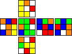
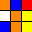
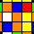
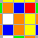
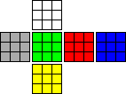
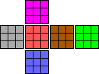

# Cube Simulator

Create your own Rubik's ​​Cube and code it.

cube-simulator is an npm package to simulate a Rubik's cube and play with it however you want. You can move faces, redo the cube, export it in svg or print it out on the terminal.


## Instalation

Open your project on the terminal and type: 

> npm install cube-simulator

or

> yarn add cube-simulator

## Basic Usage

To use it, you can simply import the package and create an object.

```
import Cube from "cube-simulator"

const cube = new Cube()
```

### Get the current state of the cube

To see how the cube pieces are doing, you can use one of the following methods:

#### getCube

```
import Cube from "cube-simulator"

const cube = new Cube()

console.log(cube.getCube())
```

This will return something like this:

```
[
  [['L1', 'L2', 'L3'], ['L4', 'L5', 'L6'], ['L7', 'L8', 'L9']], // Face 0
  [['U1', 'U2', 'U3'], ['U4', 'U5', 'U6'], ['U7', 'U8', 'U9']], // Face 1
  [['F1', 'F2', 'F3'], ['F4', 'F5', 'F6'], ['F7', 'F8', 'F9']], // Face 2
  [['D1', 'D2', 'D3'], ['D4', 'D5', 'D6'], ['D7', 'D8', 'D9']], // Face 3
  [['R1', 'R2', 'R3'], ['R4', 'R5', 'R6'], ['R7', 'R8', 'R9']], // Face 4
  [['B1', 'B2', 'B3'], ['B4', 'B5', 'B6'], ['B7', 'B8', 'B9']] // Face 5
]
```

#### getStylizedCube

```
import Cube from "cube-simulator"

const cube = new Cube()

console.log(cube.getStylizedCube())
```

This will return something like this:

```
                                Face 1
                          |-----|-----|-----|
                          |  U1 |  U2 |  U3 |
                          |-----|-----|-----|
                          |  U4 |  U5 |  U6 |
                          |-----|-----|-----|
                          |  U7 |  U8 |  U9 |
                          |-----|-----|-----|

          Face 0                Face 2                 Face 4                 Face 5
    |-----|-----|-----|   |-----|-----|-----|   |-----|-----|-----|   |-----|-----|-----|
    |  L1 |  L2 |  L3 |   |  F1 |  F2 |  F3 |   |  R1 |  R2 |  R3 |   |  B1 |  B2 |  B3 |
    |-----|-----|-----|   |-----|-----|-----|   |-----|-----|-----|   |-----|-----|-----|
    |  L4 |  L5 |  L6 |   |  F4 |  F5 |  F6 |   |  R4 |  R5 |  R6 |   |  B4 |  B5 |  B6 |
    |-----|-----|-----|   |-----|-----|-----|   |-----|-----|-----|   |-----|-----|-----|
    |  L7 |  L8 |  L9 |   |  F7 |  F8 |  F9 |   |  R7 |  R8 |  R9 |   |  B7 |  B8 |  B9 |
    |-----|-----|-----|   |-----|-----|-----|   |-----|-----|-----|   |-----|-----|-----|

                                Face 3
                          |-----|-----|-----|
                          |  D1 |  D2 |  D3 |
                          |-----|-----|-----|
                          |  D4 |  D5 |  D6 |
                          |-----|-----|-----|
                          |  D7 |  D8 |  D9 |
                          |-----|-----|-----|
```

### Move one Face

To move a face, you can use the `move (movement: string)` method that receives the move as a string parameter.

You can pass any valid cube notation for the parameter. To learn cube notation, click [here](https://ruwix.com/blog/new-rubiks-cube-notation-widget).

```
import Cube from "cube-simulator"

const cube = new Cube()

cube.move("U")
```

This will move the top face.

### Sequence of movements

When you want to do a shuffle or simply a sequence of movements, you can use the `moves (moves: string)` method which takes the movements as a string parameter. It is similar to the `move (movement: string)` method, but the parameter is then divided into an Array with several strings, each one moving.

You can also pass any valid cube notation to the parameter, as long as you divide the notations with spaces. To learn cube notation, click [here](https://ruwix.com/blog/new-rubiks-cube-notation-widget).

```
import Cube from "cube-simulator"

const cube = new Cube()

cube.moves("D2 L2 D B2 D F2 U' R2 U' B2 L2 B' U2 B D2 L2 R' D2 U' B'")
```


### Reset the cube to the initial state

When you make a few moves and want to return to the initial state of the cube, you can use the `resetCube ()` method. This method places the cube pieces in their correct place.

```
import Cube from "cube-simulator"

const cube = new Cube()

cube.resetCube()
```

### Generate a SVG of all the cube

To make a visual output of the all the cube you can use the `generateSvgAllCube ()`. This will return an string with the XML SVG.

```
import Cube from "cube-simulator"

const cube = new Cube()

cube.moves("D2 L2 D B2 D F2 U' R2 U' B2 L2 B' U2 B D2 L2 R' D2 U' B'")

generatedSvgAllCube = cube.generateSvgAllCube()
```

If you render the `generatedSvgAllCube` the expected output is something like this:



### Generate a SVG of a face

But if you just want one of the faces you can use the `generateSvgOneFace (face: 0 | 1 | 2| 3 | 4 | 5)`. The only parameter needed is the number of the face (to know the number of the face you can use `getStylizedCube()` method). This will return an string with the XML SVG.

```
import Cube from "cube-simulator"

const cube = new Cube()

cube.moves("D2 L2 D B2 D F2 U' R2 U' B2 L2 B' U2 B D2 L2 R' D2 U' B'")

generatedSvgOneFace = cube.generateSvgOneFace(0)
```

If you render the `generatedSvgOneFace` the expected output is something like this:



### Generate a SVG of a face and one layer

And also if you want one of the faces and one layer you can use the `generateSvgOneFaceOneLayer (face: 0 | 1 | 2| 3 | 4 | 5)`. The only parameter needed is the number of the face (to know the number of the face you can use `getStylizedCube()` method). This will return an string with the XML SVG.

```
import Cube from "cube-simulator"

const cube = new Cube()

cube.moves("D2 L2 D B2 D F2 U' R2 U' B2 L2 B' U2 B D2 L2 R' D2 U' B'")

generatedSvgOneFaceOneLayer = cube.generateSvgOneFaceOneLayer(0)
```

If you render the `generatedSvgOneFaceOneLayer` the expected output is something like this:



### Save SVG outputs

After create an visual output of the cube, you can export it in a local file with `exportSvg (svgOutputfile: string, svg: string)`. This method receive at first the local path to save the SVG, and secondly the XML String (you can call there the method)

```
import Cube from "cube-simulator"

const cube = new Cube()

cube.moves("D2 L2 D B2 D F2 U' R2 U' B2 L2 B' U2 B D2 L2 R' D2 U' B'")

cube.exportSvg('./exampleImages/generateSvgAllCube.svg', cube.generateSvgAllCube())
```

This method simply save the XML String in a file with the `fs` (Node.js File System Module).


## Configuring the SVG output

### Background Color

#### getBackgroundColor

> `getBackgroundColor ()`

Returns the current background color.

```
import Cube from "cube-simulator"

const cube = new Cube()

cube.getBackgroundColor()
```

`Output` - `#000`

#### setBackgroundColor

> `setBackgroundColor (backgroundColor: string)`

Receives a string from an RGB code to be the new background color. 

```
import Cube from "cube-simulator"

const cube = new Cube()

cube.moves("D2 L2 D B2 D F2 U' R2 U' B2 L2 B' U2 B D2 L2 R' D2 U' B'")

cube.setBackgroundColor('#aaa')

cube.exportSvg('./exampleImages/setBackgroundColor.svg', cube.generateSvgOneFaceOneLayer(0))
```

`Exported SVG`:




### Faces Colors

#### getFaceColors

> `getFaceColors ()`

Returns the current array of faces colors.

```
import Cube from "cube-simulator"

const cube = new Cube()

cube.getFaceColors()
```

`Output` - `[ '#ff8800', '#fff', '#00ff00', '#ffff00', '#ff0000', '#0000ff' ]`


#### setFaceColor

To change only one face color

> `setFaceColor (face: 0 | 1 | 2| 3 | 4 | 5, color: string)`

Receives the number of the face (to know the number of the face you can use `getStylizedCube()` method) and a string from an RGB code to be the new color of the respective face. 

```
import Cube from "cube-simulator"

const cube = new Cube()

cube.moves("D2 L2 D B2 D F2 U' R2 U' B2 L2 B' U2 B D2 L2 R' D2 U' B'")

cube.setFaceColor(0, '#aaa')

cube.exportSvg('./exampleImages/setFaceColor.svg', cube.generateSvgAllCube())
```

`Exported SVG`:



#### setFaceColors

To change all face colors

> `setFaceColors (faceColors: Array<string>)`

Receive an array with 6 RGB codes to be the new face colors. 

```
import Cube from "cube-simulator"

const cube = new Cube()

cube.moves("D2 L2 D B2 D F2 U' R2 U' B2 L2 B' U2 B D2 L2 R' D2 U' B'")

cube.setFaceColors(['#aaa', '#f0f', '#f55', '#66f', '#a50', '#0f0'])

cube.exportSvg('./exampleImages/setFaceColors.svg', cube.generateSvgAllCube())
```

`Exported SVG`:


